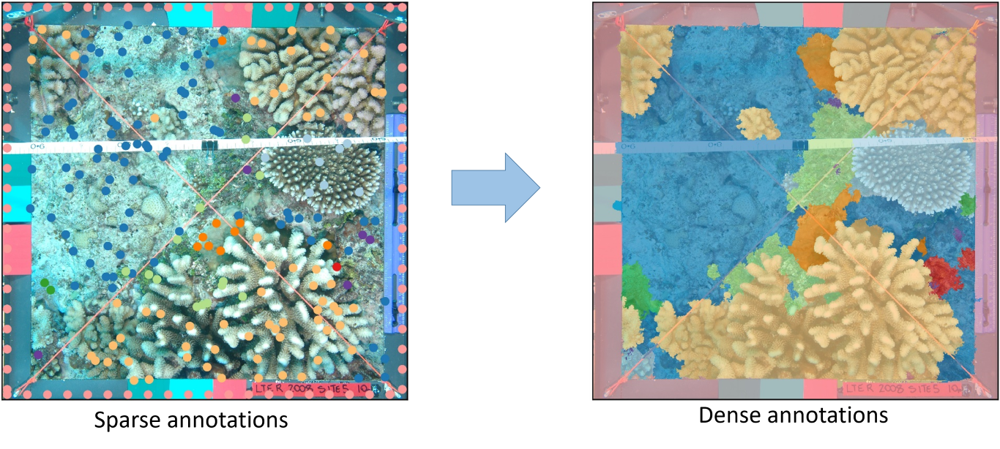

# Fast Multilevel Superpixel Segmentation (Fast-MSS)

Fast-MSS [1] is an improvement to [MSS](https://github.com/Shathe/ML-Superpixels), which was developed in [2] for the purpose of converting the existing sparse annotations for an image into dense annotations automatically. Fast-MSS is written entirely in Python and offers an easy-to-use API. 

The main advantages of Fast-MSS over MSS are:
1.	Instead of joining the labels made from each iteration, it was found that by calculating the mode of class labels across all iterations the accuracy of the resulting dense annotations are comparable or better;
2.	For an over-segmentation algorithm, [Fast-SLIC](https://github.com/Algy/fast-slic) is used, which includes optimization techniques for use on a common CPU allowing it to perform 10x-33x faster than the conventional implementation [3]. 

The code can be used as easily as:
```python
# Must include all possible class labels in dataset
labels = ['Acrop', 'CCA', 'Macro', 'Monti', 'Off', 'Pavon', 'Pocill', 'Porit', 'Sand', 'Turf'] 

img = skimage.io.imread('MLC_example_1.png')
sparse = pandas.read_csv('MLC_example_1.csv') 
# format expected: columns = ['X', 'Y', 'Label']

mask = fast_mss(img, sparse, labels, start_iter = 7500, end_iter = 80, num_iter = 20, method = 'mode')
```
A more detailed example can be found in `Notebooks`

### Tips
* **Speed Boost:** Resizing the dimensions of images increases the speed of Fast-MSS without significantly affecting the accuracy of the resulting mask; remember to always use nearest neighbor interpolation when resizing masks.
* The best values for the parameters `start_iter`, `end_iter`, and `num_iter` differ based of the resolution of the image and number of sparse annotations provided; try different values for different datasets.
* **Power Move:** Having more sparse annotations increases the quailty of Fast-MSS output; to increase the number of sparse annotations associated with each image, consider training a patch-based image classifier on any existing annotations and then use *it* to add additional annotations for you [1].
* **Next Level:** With enough images/dense annotations, look into training a [deep learning semantic segmentation algorithm](https://github.com/qubvel/segmentation_models) [4] so you won't need to produce sparse annotations for images collected in the future. 



## Requirements
* cv2
* numpy
* pandas
* skimage
* matplotlib
* seaborn
* fast_slic

### References
1.  J. Pierce, Y. Rzhanov, K. Lowell, J. Dijkstra, “Reducing Annotation Times: Semantic Segmentation of Coral Reef Imagery”, *2020 IEEE Global Oceans.*
2.  I. Alonso, M. Yuval, G. Eyal, T. Treibitz, and A. C. Murillo, Multilevel Superpixel Segmentation, GitHub repository, https://github.com/Shathe/ML-Superpixels
3.  K. Alchan, Fast-SLIC, (2019), GitHub repository, https://github.com/Algy/fast-slic
4.  P. Yakubovskiy, Segmentation Models, (2019), GitHub Repository, https://github.com/qubvel/segmentation_models
